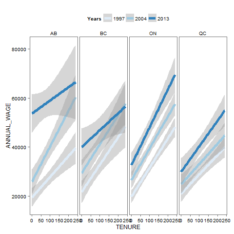
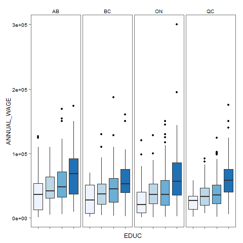
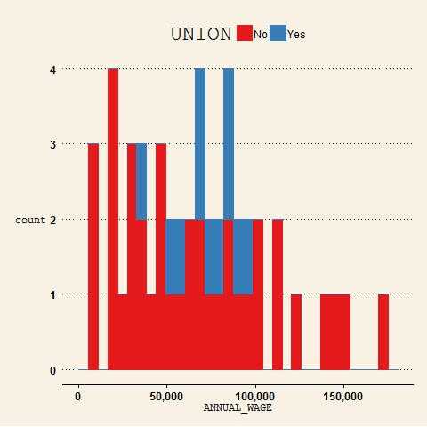
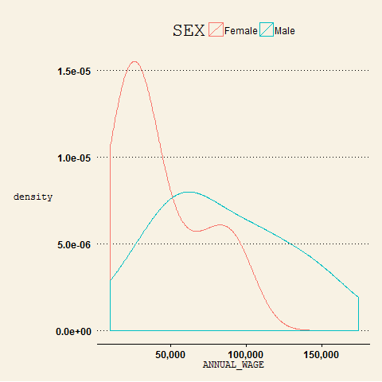

STAT 545A Homework 6
========================================================

_Jack Ni_

Labour Force Survey - Annual Wage Analysis
-------------------------

The LFS is a national survey measuring many factors of employed (or unemployed) people. The information obtained contains sex, age group, education, hourly earnings, and job tenure. I will be using this data to see what combination of characteristics will potentially give the highest wage.

The original dataset from 1997 to 2013 contains almost 2 million entries for all of Canada's provinces. To narrow this down, we only kept those from Alberta, British Columbia, Ontario, and Quebec. To further reduce this, a random sample of 1000 was taken from each year to make the dataset I will be working on.

Start by looking at an overview of how annual wage is distributed.


The spread looks like what we would expect with a right skew and the mode around $50,000.

To narrow down some factors, I make some regression plots between wage and tenure for each of the four provinces in the years 1997, 2004, and 2013.



So the most obvious point to notice is the increase in wage over time. 2013 has the highest wages compared to 1997. Also, Alberta appears to have the highest wage compared to the other provinces even without factoring in tenure. 

With that, I can narrow my focus onto the data from Alberta in recent years. Looking at education next:


The mean wage of people with Bachelors or higher is unsurprisingly higher than the other education levels. Those with some post-secondary education such as college only makes marginally more than highschool grads which is slightly surprising.

I take a look at the other provinces to see if this is also the case.



The other 3 provinces also have this case. I fit a linear regression line to see the effect of these two education levels on wage over the course of the 17 years.

```{r echo = FALSE}
library(plyr)
library(xtable)
```

```{r results = 'asis'}
lfs <- read.delim("LFS.csv")

regfun <- function(x) {
  lm_sum <- summary(lm(ANNUAL_WAGE ~ EDUC, x))
  estCoefs <- cbind(coef(lm_sum)[, 1], coef(lm_sum)[, 2])
  estCoefs <- estCoefs[-1,]
  names(estCoefs) <- c("slope", "standard error")
  return(estCoefs)
}

wage_reg <- ddply(subset(lfs, PROV == "AB" & EDUC %in% c("Some PS", "HS Grad")), ~ SURVYEAR, regfun)
x <- xtable(wage_reg)
print(x, type="html", include.rownames = FALSE)
```

There does not seem to be a significant difference on the effect on wage between the two education levels throughout the years.

Looking at unions:



Those without unions make a much higher wage than those with in my subsetted data.

Looking at sex:



Women have a smaller variance than men, but we can see men have a much higher wage.

Looking at age:


The third age group 45-59 make more on than the other groups. It is quite interesting to see the jumps in wage level from one group to the next.

So overall, it seems men working in Alberta of the age 45-59 with some post secondary education or more and not in a union make the highest wage. Thinking about this intuitively, the results aren't too surprising if we think about the oil industry in Alberta. The industry is more likely to attract younger males who haven't settled down yet to work at more isolated environments with a reward of high pay.

_Worked in collaboration with Jonathan Zhang_